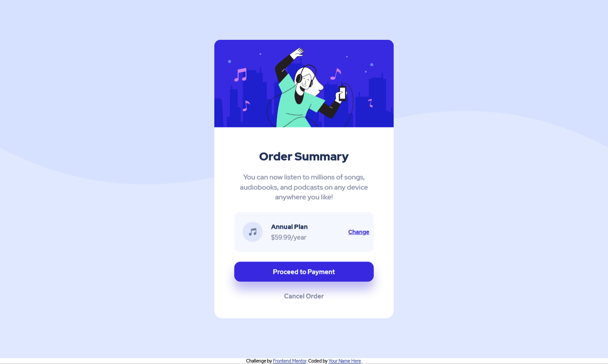

# Frontend Mentor - Order summary card solution

Esta é uma solução para o desafio do cartão de resumo de pedido do site Frontend Mentor. O desafio teve objetivo de ajudar a melhorar as habilidades de codificação ao construir um projeto realista.

### Screenshot

### Links

- Live Site URL: https://order-summary-frontend-mentor.netlify.app/

### Built with

- HTML5
- CSS3
- Flexbox
- Media Query

## Author

- Website - https://github.com/danimichelydev
- Frontend Mentor - [@danimichelydev](https://www.frontendmentor.io/profile/danimichelydev)
- Instagram - [@danielamichely](https://www.instagram.com/danielamichely/)

